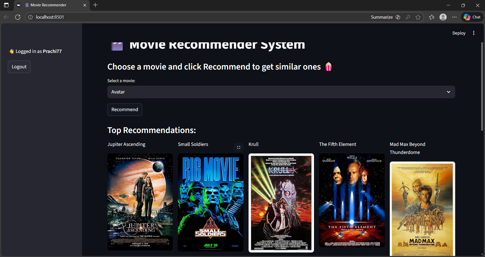

#  Movie Recommendation System

A Machine Learning-based Movie Recommendation System built using Python and Streamlit.
This application recommends movies based on similarity using content-based filtering.

---

##  Features

* 🎯 Recommend similar movies instantly
* 🖼️ Displays movie posters
* ⚡ Fast and interactive UI using Streamlit
* 🧠 Uses similarity matrix for accurate recommendations

---

##  Tech Stack

* Python
* Pandas
* NumPy
* Scikit-learn
* Streamlit

---

## 📂 Project Structure

movie-recommender-system/
│── app.py
│── requirements.txt
│── README.md
│── (model files not included)

---

## ▶️ How to Run Locally

1. Clone the repository
   git clone https://github.com/YOUR_USERNAME/MOVIE_RECOMMENDATION_SYSTEM.git

2. Navigate to the folder
   cd MOVIE_RECOMMENDATION_SYSTEM

3. Install dependencies
   pip install -r requirements.txt

4. Run the application
   streamlit run app.py

---

## ⚠ Important Note (Model Files)

Due to GitHub file size limits, the trained model files (.pkl) are not included in this repository.

---

##  How It Works

* Converts movie data into feature vectors
* Calculates similarity using cosine similarity
* Recommends top similar movies based on user input

---

## Screenshots

## Login Page

### Recommendation Output

